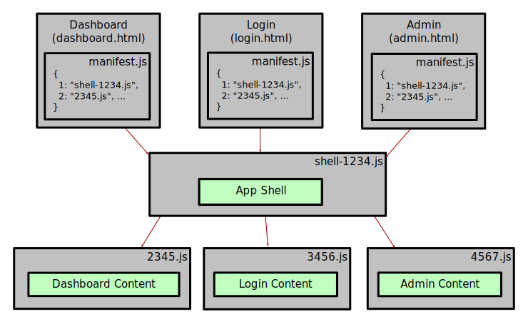
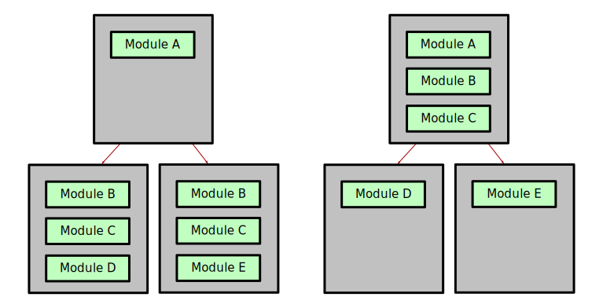
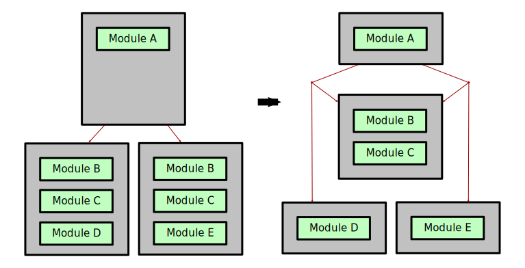

## ⌛️ Caching ⌛️ [Beginner]

Add a **hash** of the file content **to filename**. 📧

``` js
output: { // in production
  filename: "[chunkhash].js", 📲
  chunkFilename: "[chunkhash].js" 📲
}
```

**`file-loader`**/**`url-loader`**: *default* of `name` is *`[hash][ext]`*.

**`css-loader`**: *default* of `localIdentName` is *`[hash:base64]`*.

---

---

## 🚧 Caching 🚧 [Expert]

*Fact*: Using **`[chunkhash]`** adds a **list of all hashes** to the entry chunk (first js file).

<br>

*Problem*: entry chunk is **invalidated** when **any chunk** changes :(

<br>

*Solution*: Small **entry chunk**, and **inline** it into HTML.

---

---

## Caching: Manifest chunk [Expert]



---

---

## Caching: Manifest chunk [Expert]

``` js
output: {
  filename: "[chunkhash].js"
  chunkFilename: "[chunkhash].js"
},
plugins: [
  new webpack.optimize.CommonsChunkPlugin({
    name: "manifest",
    filename: "manifest.js",
    minChunks: Infinity
  })
]
```

---

---

## Caching: Move To Parent [Expert]



``` js
new CommonChunkPlugin({ name: "main", children: true })
```
---

---

## Caching: Async Chunk [Expert]



``` js
new CommonChunkPlugin({ name: "main", async: true })
```